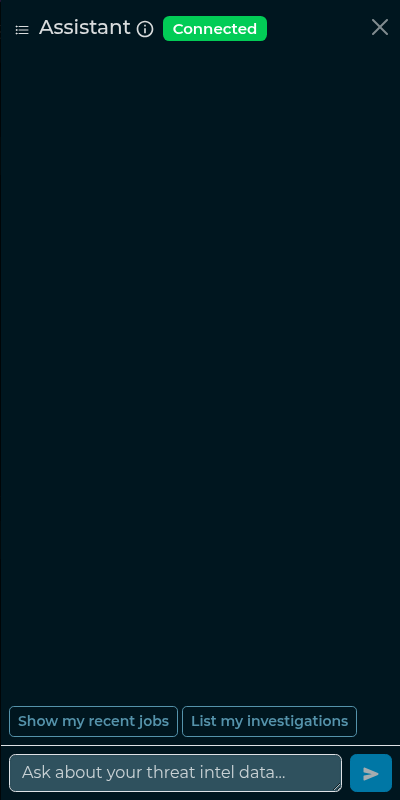
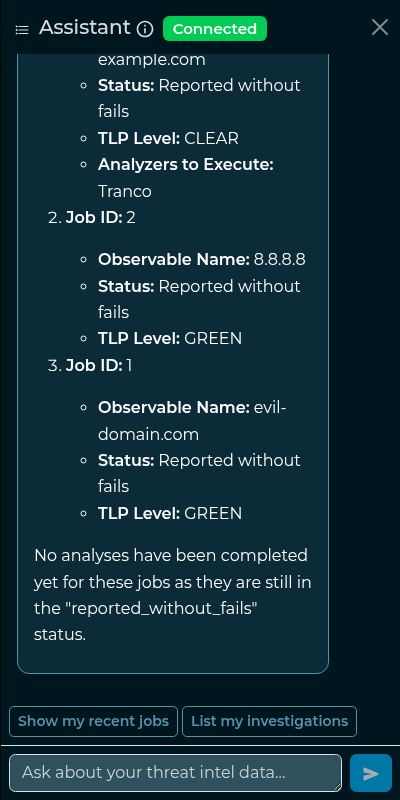
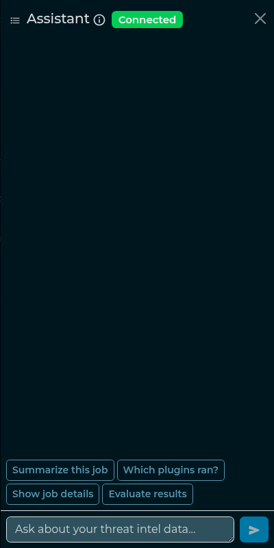

# Chatbot

_Available from version >= 6.7.0_

The IntelOwl chatbot is a locally-hosted LLM assistant that answers natural-language questions over
your threat-intelligence data. It runs entirely on your own deployment (Ollama) and **never sends
data to external APIs** — your jobs, observables and reports never leave the instance.

The chatbot is an optional component. If your deployment was not started with the Ollama service,
the chat button does not connect; see the
[deployment guide](./installation.md#chatbot-ollama) to enable it.

## What it can do

Ask in plain language and the assistant answers by calling read-only IntelOwl tools on your behalf:

- search your jobs and show a job's details;
- summarize a job — including IntelOwl's verdict on the observable — or an investigation;
- show an investigation's job tree;
- show a job's aggregated data model;
- list the analyzers available on the instance;
- recommend a playbook for an observable.

Everything it returns is **scoped to what you can already see** in the UI (your own data, plus what
your organization and TLP visibility allow). The chatbot cannot reveal anything you could not reach
through the normal interface.

## Opening the chat

Click the chat-bubble icon in the top navigation bar to open the chat drawer. The drawer overlays
the current page and the rest of the app stays usable while it is open; it also stays available as
you navigate between pages.

A small status badge shows whether the assistant is connected and ready.

## Asking a question

Type a question and press send. The answer streams in token by token. When a question needs data,
the assistant calls one of the tools above and shows the result formatted (tables, lists and links
are rendered).

Example questions:

- "Show me my most recent jobs."
- "Summarize job #1234."
- "Is job #1234 malicious?"
- "Which analyzers can run on a domain?"
- "Which playbook should I use for an IP address?"

## Quick actions

Below the input you'll find one-click quick actions. They are **context-aware**: on a job page they
offer job actions ("Summarize & evaluate", "Which plugins ran?", "Show job details"), on an
investigation page they offer investigation actions, and elsewhere they offer general ones ("Show my
recent jobs", "List my investigations"). Clicking a chip sends the corresponding question for you.

## The verdict on a job

When you summarize a job, the assistant also reports **IntelOwl's own verdict** on the observable —
the same evaluation the job page badge shows — together with the evidence behind it: which analyzers
support it, which disagree, and which produced no opinion at all.

The verdict is never the model's own judgement. It is the platform's reconciliation of the analyzer
data models, so the chatbot says the same word the badge does. When no analyzer produced an
evaluation — or the observable is a `generic` one, which IntelOwl does not evaluate — the assistant
reports that instead of guessing.

Because the verdict travels with the summary, "summarize job #N", "evaluate the results of job #N"
and "is job #N malicious?" all reach it.

## Working with the page you're on

The chatbot knows which page you are viewing. If you are on a job or investigation page, you can
refer to "this job" / "this investigation" and the assistant resolves it from the current page —
no need to copy the ID.

## Conversations

Each chat is saved as a conversation so you can come back to it. From the drawer you can:

- start a **new chat**;
- open the **conversation list** to switch between past conversations;
- review a conversation's **history** (older messages load automatically);
- **delete** a conversation you no longer need.

Old conversations are pruned automatically after a retention period configured by the operator (see
the [advanced configuration](./advanced_configuration.md#chatbot)).

## Launching an analysis safely

The chatbot can suggest running a new analysis on an observable, but it **cannot start one by
itself**. When you ask it to analyze something, it shows a **preview** of what would run and a
Confirm / Cancel card. The analysis starts only when **you** click **Confirm** (Cancel discards it).
The same TLP and visibility rules as the normal analysis flow apply.

This is a deliberate safety guardrail: even if the model misbehaves, it has no path to launch an
analysis — and therefore cannot send an observable to external analyzers — without an explicit click
from you.

## Limits and availability

- **Rate limit.** To protect the instance there is a per-user limit on how many messages you can
  send per minute; if you hit it, wait a moment and try again.
- **Model availability.** If the chatbot worker or the Ollama service is not running, the drawer
  shows an "unavailable" state instead of the connected badge and turns are not served — ask your
  operator to enable/restart the Ollama service.
- **Long conversations.** A conversation is kept in full, but a very long one can exceed the model's
  context window (`num_ctx`); when that happens Ollama drops the oldest tokens, so the assistant may
  lose the earliest messages. There is no automatic summarization of the conversation.
